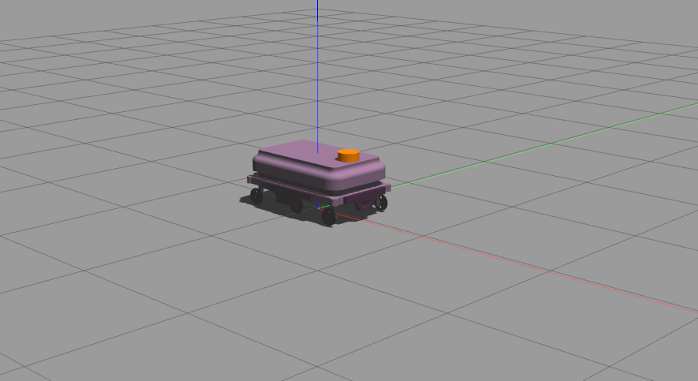
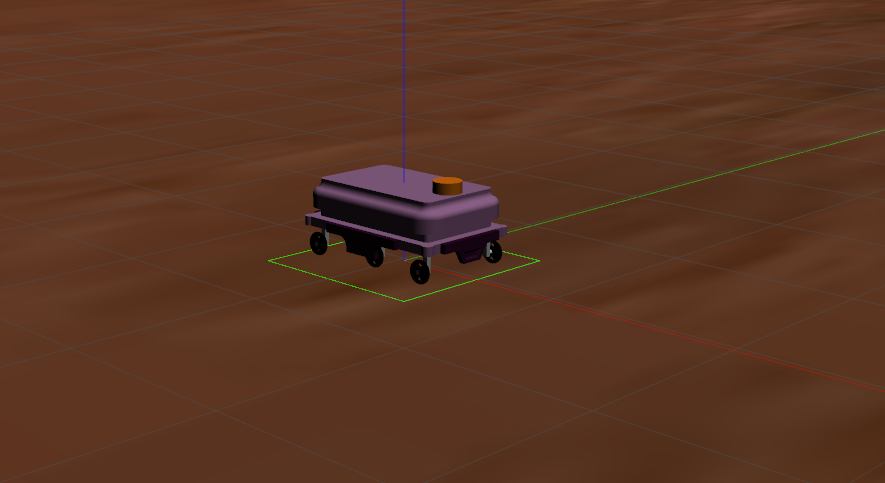
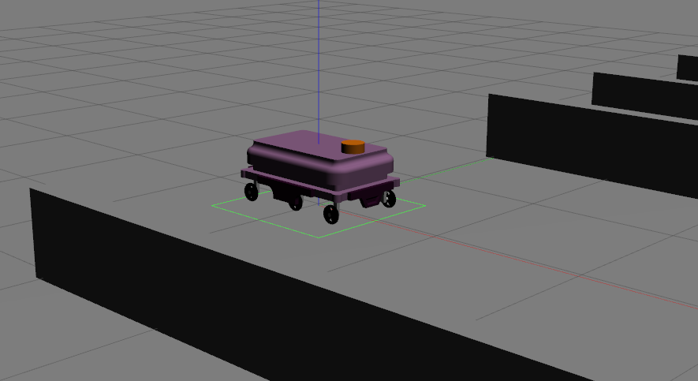

# New BCR Robot

A 6 wheeled differential drive robot with camera, 2D lidar and conveyor belt. The repository offers files for [gazebo classic](https://classic.gazebosim.org/).

## Dependencies

```bash
# From the root directory of the workspace. This will install everything mentioned in package.xml
rosdep install --from-paths src --ignore-src -r -y
```

## Build Instructions

* Build the package:

```bash
catkin build --packages-select new_bcr_robot
```

## Run Instructions

* To Launch the robot in gazebo:

```bash
roslaunch new_bcr_robot gazebo.launch
```

* To Launch the robot in RViz:

```bash
roslaunch new_bcr_robot rviz.launch
```

## Configuration

### Xacro 

The xacro (refer to `urdf/new_bcr_robot.xacro`) has loads of configuration options as xacro arguments. To mention any one of the configurations, head over to the desired launch file; `gazebo.launch` or `rviz.launch` and edit the robot description parameter.

Example:
```xml
<param name="robot_description" command="$(find xacro)/xacro $(find new_bcr_robot)/urdf/new_bcr_robot.xacro
	two_d_lidar_enabled:=$(arg two_d_lidar_enabled)
	camera_enabled:=$(arg camera_enabled)
	wheel_odom_topic:=$(arg wheel_odom_topic)
	conveyor_enabled:=$(arg conveyor_enabled)
	robot_namespace:=$(arg robot_namespace)
	" />
```

1. `two_d_lidar_enabled`: If you want to use the 2D Lidar in the simulation.
2. `conveyor_enabled`: If the conveyor belt atop the robot is to be used, enable this flag to true.
3. `camera_enabled`: If the camera is to be used, enable this flag to true.
4. `wheel_odom_topic`: The odometry topic to publish wheel odom from diff drive plugin into.
5. `robot_namespace`: The namespace of the robot


### World File

The `worlds` directory has two `.world` files, to pass them to gazebo edit the `launch/gazebo.launch` and modify the arg `world_name`. The following are the world outputs:

* Empty World (Default):

	

* Mars World:

	

* Corridor World:

	
