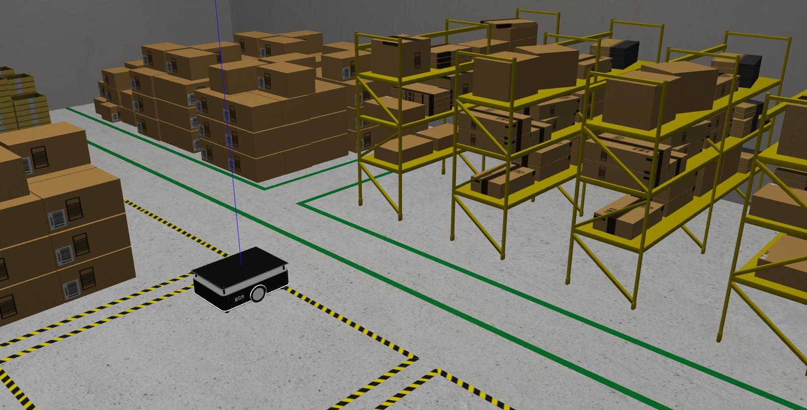
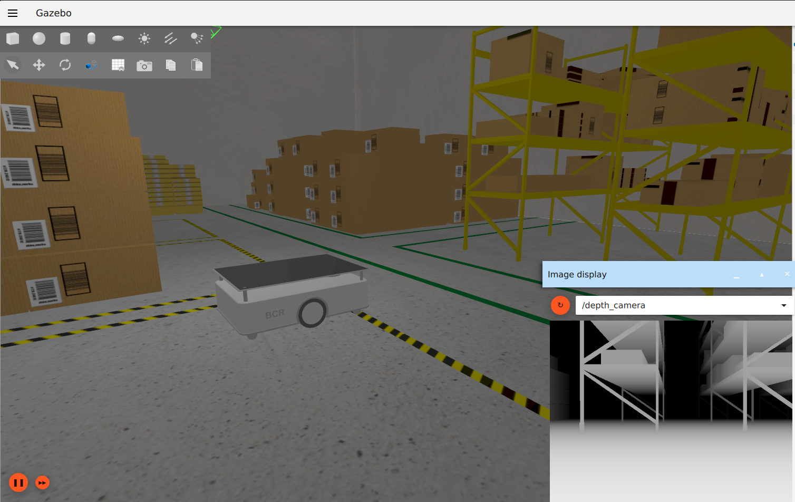
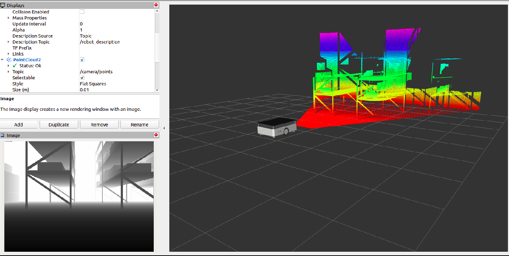

# New BCR Robot

## About

This repository contains a Gazebo simulation for a differential drive robot, equipped with an IMU, a depth camera and a 2D LiDAR. The primary contriution of this project is to support multiple ROS and Gazebo distros. Currently, the project supports the following versions - 

1. ROS Noetic + Gazebo Classic 11
2. ROS2 Humble + Gazebo Classic 11
3. ROS2 Humble + Gazebo Fortress

Each of the following sections describes depedencies, build and run instructions for each of the above combinations

## Noetic + Classic (Ubuntu 20.04)

### Dependencies

In addition to ROS1 Noetic and Gazebo Classic installations, the dependencies can be installed with [rosdep](http://wiki.ros.org/rosdep)

```bash
# From the root directory of the workspace. This will install everything mentioned in package.xml
rosdep install --from-paths src --ignore-src -r -y
```

### Build

```bash
catkin build --packages-select new_bcr_robot
```

### Run

To launch the robot in Gazebo,
```bash
roslaunch new_bcr_robot gazebo.launch
```
To view in rviz,
```bash
roslaunch new_bcr_robot rviz.launch
```
### Configuration

The launch file accepts multiple launch arguments,
```bash
roslaunch new_bcr_robot gazebo.launch 
	camera_enabled:=True
	two_d_lidar_enabled:=True
	position_x:=0.0
	position_y:=0.0
	orientation_yaw:=0.0
	world_file:=small_warehouse.world
```

## Humble + Classic (Ubuntu 22.04)

### Dependencies

In addition to ROS2 Humble and Gazebo Classic installations, we need to manually install [gazebo_ros_pkgs](https://github.com/ros-simulation/gazebo_ros_pkgs/tree/ros2) (since the same branch supports Classic and Fortress)

```bash
sudo apt-get install ros-humble-gazebo-ros-pkgs
```
Remainder of the dependencies can be installed with [rosdep](http://wiki.ros.org/rosdep)

```bash
# From the root directory of the workspace. This will install everything mentioned in package.xml
rosdep install --from-paths src --ignore-src -r -y
```

### Build

```bash
colcon build --packages-select new_bcr_robot
```

### Run

To launch the robot in Gazebo,
```bash
ros2 launch new_bcr_robot gazebo.launch.py
```
To view in rviz,
```bash
ros2 launch new_bcr_robot rviz.launch.py
```
### Configuration

The launch file accepts multiple launch arguments,
```bash
ros2 launch new_bcr_robot gazebo.launch.py 
	camera_enabled:=True
	two_d_lidar_enabled:=True
	position_x:=0.0
	position_y:=0.0
	orientation_yaw:=0.0
	world_file:=small_warehouse.world
```

## Humble + Fortress

### Dependencies

In addition to ROS2 Humble and [Gazebo Fortress installations](https://gazebosim.org/docs/fortress/install_ubuntu), we need to manually install interfaces between ROS2 and Gazebo sim as follows,

```bash
sudo apt-get install ros-humble-ros-gz-sim ros-humble-ros-gz-bridge ros-humble-ros-gz-interfaces 
```
Remainder of the dependencies can be installed with [rosdep](http://wiki.ros.org/rosdep)

```bash
# From the root directory of the workspace. This will install everything mentioned in package.xml
rosdep install --from-paths src --ignore-src -r -y
```

### Build

```bash
colcon build --packages-select new_bcr_robot
```

### Run

To launch the robot in Gazebo,
```bash
ros2 launch new_bcr_robot gz.launch.py
```
To view in rviz,
```bash
ros2 launch new_bcr_robot rviz.launch.py
```

### Configuration

The launch file accepts multiple launch arguments,
```bash
ros2 launch new_bcr_robot gz.launch.py 
	camera_enabled:=True
	two_d_lidar_enabled:=True
	position_x:=0.0
	position_y:=0.0
	orientation_yaw:=0.0
	world_file:=small_warehouse.world
```

### World File Configurations

The `worlds` directory has two subdirectories: `gazebo` and `gz`. Both of these host world file for each simulator respectively. Here are the expected outputs from each world configuration:

1. Gazebo Classic (small_warehouse):

	Launch file Change in the Launch Description:
	```python
	DeclareLaunchArgument(
		'world', default_value=[FindPackageShare('new_bcr_robot'), '/worlds/small_warehouse.world'],
	)
	```
	

2. Gz Sim (Ignition Gazebo) (small_warehouse World):
	

2. Rviz (Depth camera) (small_warehouse World):
	
