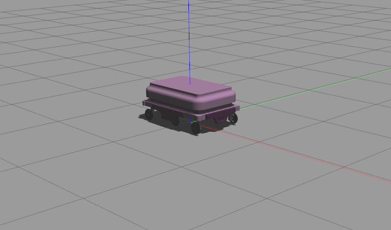
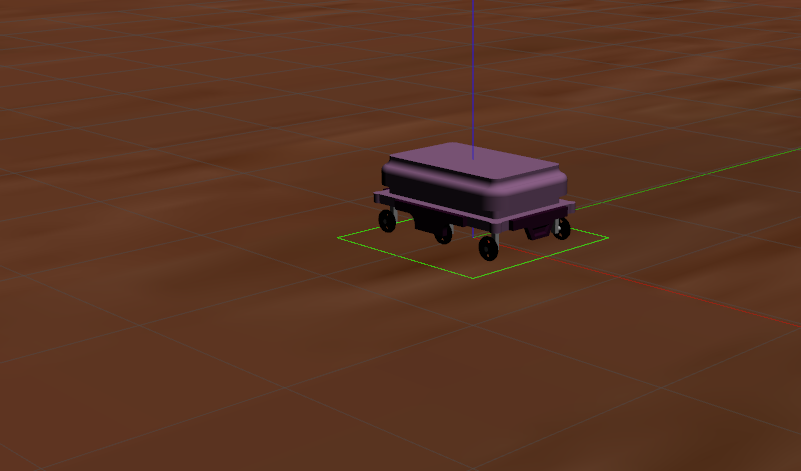
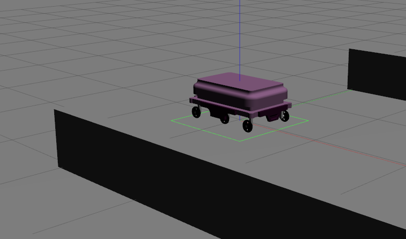
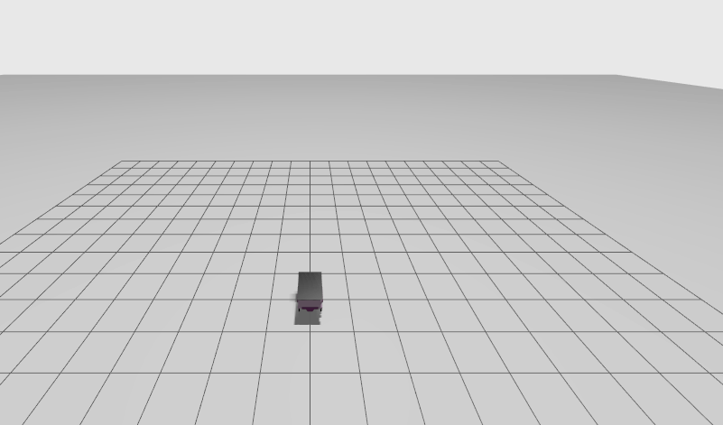

# New BCR Robot

## About

A 6 wheeled differential drive robot with camera, 2D lidar and conveyor belt. The repository offers files for both simulators [gazebo classic](https://classic.gazebosim.org/) and [gazebo](https://gazebosim.org/home).

## Dependencies

* ROS Dependencies:
	```bash
	# From the root directory of the workspace. This will install everything mentioned in package.xml
	rosdep install --from-paths src --ignore-src -r -y
	```
* Gazebo Classic Dependencies:
	```bash
	sudo apt-get install ros-humble-gazebo-ros-pkgs
	```
* Gazebo Dependencies:
	```bash
	sudo apt-get install ros-humble-ros-gz-sim ros-humble-ros-gz-bridge ros-humble-ros-gz-interfaces 
	```

## Build Instructions

* Build the package:

		colcon build --symlink-install

## Run Instructions

* Launch the robot in gazebo:

		ros2 launch new_bcr_robot gazebo.launch.py

* Launch the robot in RViz:

		ros2 launch new_bcr_robot rviz.launch.py

* Launch the robot in Ignition Gazebo Fortress

		ros2 launch new_bcr_robot gz.launch.py

## Configuration

### Xacro Configurations

The xacro (refer to `urdf/new_bcr_robot.xacro`) has loads of configuration options as xacro arguments. To mention any one of the configurations, head over to the desired launch file; `launch/gz.launch.py` or `launch/gazebo.launch.py` and add the options in the dictionary being passed to the `get_xacro_to_doc` function call.

Example:
```python
robot_description_content = get_xacro_to_doc(
	join(new_bcr_robot_path, "urdf", "new_bcr_robot.xacro"),
	{"wheel_odom_topic": "odom",
		"sim_gz": "true",
		"two_d_lidar_enabled": "true",
		"conveyor_enabled": "true",
		"camera_enabled": "true"
	}
).toxml()
```

1. `sim_gz`/`sim_gazebo`: Depending on the simulator being passed use the appropriate flag. If no simulator is to used do not pass anything.
2. `two_d_lidar_enabled`: If you want to use the 2D Lidar in the simulation.
3. `conveyor_enabled`: If the conveyor belt atop the robot is to be used, enable this flag to true.
4. `camera_enabled`: If the camera is to be used, enable this flag to true.

### World File Configurations

The `worlds` directory has two subdirectories: `gazebo` and `gz`. Both of these host world files for each simulator respectively. Here are the expected outputs from each world configuration:

1. Gazebo Classic (Empty World):

	Launch file Change in the Launch Description:
	```python
	DeclareLaunchArgument(
		'world', default_value=[FindPackageShare('gazebo_ros'), '/worlds/empty.world'],
	)
	```
	

2. Gazebo Classic (Mars):
	Launch file Change in the Launch Description:
	```python
	DeclareLaunchArgument(
		'world', default_value=[FindPackageShare('new_bcr_robot'), '/worlds/gazebo/mars.world'],
	)
	```
	

3. Gazebo Classic (Corridor):
	Launch file Change in the Launch Description:
	```python
	DeclareLaunchArgument(
		'world', default_value=[FindPackageShare('new_bcr_robot'), '/worlds/gazebo/corridor.world'],
	)
	```
	

4. Gz Sim (Ignition Gazebo) (Empty World):\
	No Changes to launch file\
	