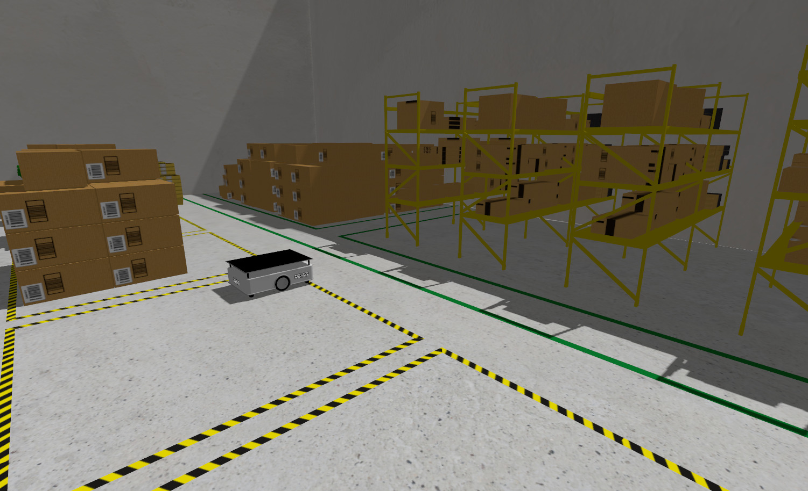
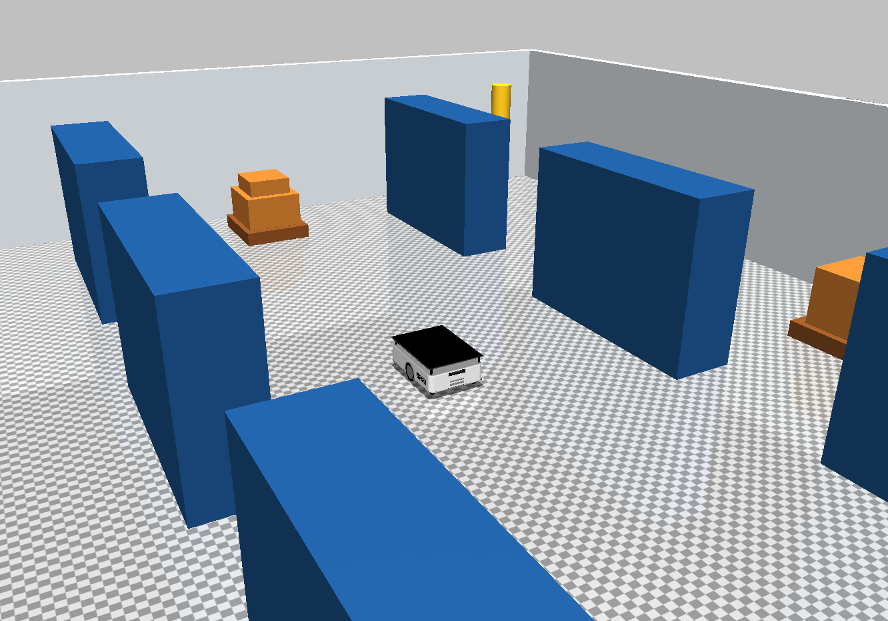
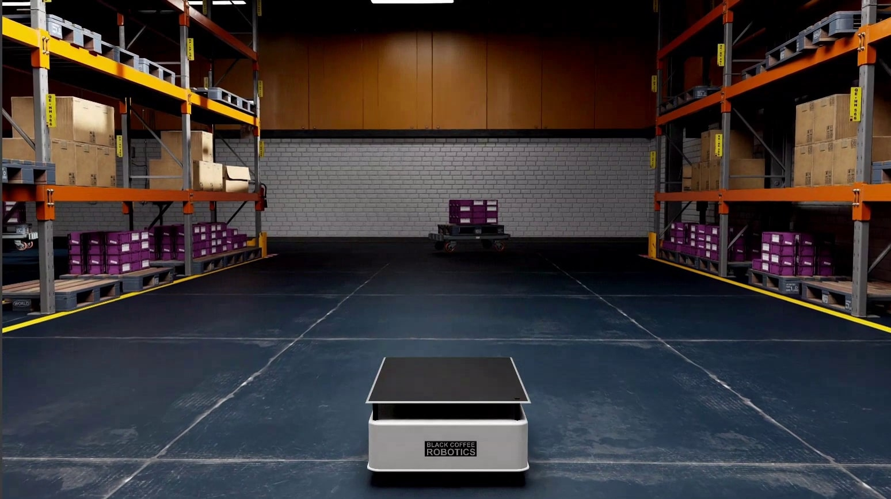
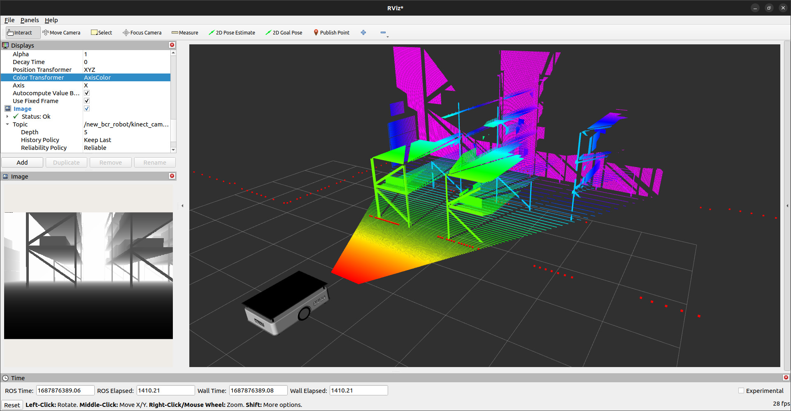

# BCR Bot

https://github.com/blackcoffeerobotics/bcr_bot/assets/13151010/0fc570a3-c70c-415b-8222-b9573d5911c8

## About

This repository contains [Gazebo](https://gazebosim.org/home), [MuJoCo](https://mujoco.org/), and [Isaac Sim](https://developer.nvidia.com/isaac/sim) simulations for a differential drive robot, equipped with an IMU, a depth camera, stereo camera and a 2D LiDAR. ROS2 versions also include [Nav2](https://docs.nav2.org/) and [SLAM Tool Box](https://github.com/SteveMacenski/slam_toolbox) support. Currently, the project supports the following combinations - 

1. [ROS Noetic + Gazebo Classic 11 (branch ros1)](https://github.com/blackcoffeerobotics/bcr_bot/tree/ros1?tab=readme-ov-file#noetic--classic-ubuntu-2004)
2. [ROS2 Humble + Gazebo Classic 11 (branch ros2)](https://github.com/blackcoffeerobotics/bcr_bot/tree/ros2?tab=readme-ov-file#humble--classic-ubuntu-2204)
3. [ROS2 Humble + Gazebo Fortress (branch ros2)](https://github.com/blackcoffeerobotics/bcr_bot/tree/ros2?tab=readme-ov-file#humble--fortress-ubuntu-2204)
4. [ROS2 Humble + Gazebo Harmonic (branch ros2)](https://github.com/blackcoffeerobotics/bcr_bot/tree/ros2?tab=readme-ov-file#humble--harmonic-ubuntu-2204)
5. [ROS2 Humble + Isaac Sim (branch ros2)](https://github.com/blackcoffeerobotics/bcr_bot/tree/ros2?tab=readme-ov-file#humble--isaac-sim-ubuntu-2204)
6. [ROS2 Jazzy + Gazebo Harmonic (branch ros2-jazzy)](https://github.com/blackcoffeerobotics/bcr_bot/tree/ros2-jazzy?tab=readme-ov-file#jazzy--harmonic-ubuntu-2404)
7. [ROS2 Jazzy + Isaac Sim (branch ros2-jazzy)](https://github.com/blackcoffeerobotics/bcr_bot/tree/ros2-jazzy?tab=readme-ov-file#jazzy--isaac-sim-ubuntu-2404)
8. [ROS2 Jazzy + MuJoCo Sim (branch ros2-jazzy)](https://github.com/blackcoffeerobotics/bcr_bot/tree/ros2-jazzy?tab=readme-ov-file#jazzy--mujoco-ubuntu-2404)

Each of the following sections describes depedencies, build and run instructions for the combinations supported by the `ros2-jazzy` branch.

## Jazzy + Harmonic (Ubuntu 24.04)

### Dependencies

Install Gazebo harmonic using ROS2 binaries:
```bash
sudo apt install ros-jazzy-ros-gz-sim ros-jazzy-ros-gz-bridge ros-jazzy-ros-gz-interfaces
```

Install other dependencies with [rosdep](http://wiki.ros.org/rosdep).
```bash
# From the root directory of the workspace. This will install everything mentioned in package.xml
rosdep install --from-paths src --ignore-src -r -y
```

### Build

```bash
colcon build --packages-select bcr_bot
```

### Run

To launch the robot in Gazebo,
```bash
ros2 launch bcr_bot gz.launch.py
```
To view in rviz,
```bash
ros2 launch bcr_bot rviz.launch.py
```

### Configuration

The launch file accepts multiple launch arguments,
```bash
ros2 launch bcr_bot gz.launch.py \
	camera_enabled:=True \
	stereo_camera_enabled:=False \
	two_d_lidar_enabled:=True \
	position_x:=0.0 \
	position_y:=0.0  \
	orientation_yaw:=0.0 \
	odometry_source:=world \
	world_file:=small_warehouse.sdf
```
**Note:** 
1. To use stereo_image_proc with the stereo images excute following command: 
```bash
ros2 launch stereo_image_proc stereo_image_proc.launch.py left_namespace:=bcr_bot/stereo_camera/left right_namespace:=bcr_bot/stereo_camera/right
```
## Jazzy + MuJoCo (Ubuntu 24.04)

### Dependencies

Install the simulation, controller, visualization, and navigation packages:

```bash
sudo apt update
sudo apt install \
  ros-jazzy-mujoco-ros2-control \
  ros-jazzy-mujoco-ros2-control-plugins \
  ros-jazzy-ros2controlcli \
  ros-jazzy-joint-state-broadcaster \
  ros-jazzy-imu-sensor-broadcaster \
  ros-jazzy-diff-drive-controller \
  ros-jazzy-depth-image-proc \
  ros-jazzy-twist-stamper \
  ros-jazzy-teleop-twist-keyboard \
  ros-jazzy-rviz2 \
  ros-jazzy-slam-toolbox \
  ros-jazzy-navigation2 \
  ros-jazzy-nav2-bringup
```

Install the remaining declared dependencies from the workspace root:

```bash
rosdep install --from-paths src --ignore-src -r -y
```

### Build

Run from the workspace root:

```bash
colcon build --packages-select bcr_bot
source install/setup.bash
```

### Run

Launch the robot in the MuJoCo warehouse:

```bash
ros2 launch bcr_bot mujoco.launch.py
```

The launch enables wheel control and odometry, IMU, 2D LiDAR, the depth camera, and stereo cameras. A colored point cloud is generated for the depth camera.

To view the robot and sensor data in RViz, open another sourced terminal:

```bash
ros2 launch bcr_bot rviz.launch.py
```


### Jazzy + Isaac Sim (Ubuntu 24.04)

### Dependencies

In addition to ROS2 Humble [Isaac Sim installation](https://docs.omniverse.nvidia.com/isaacsim/latest/installation/index.html) with ROS2 extension is required. Remainder of bcr_bot specific dependencies can be installed with [rosdep](http://wiki.ros.org/rosdep)

```bash
# From the root directory of the workspace. This will install everything mentioned in package.xml
rosdep install --from-paths src --ignore-src -r -y
```

### Build

```bash
colcon build --packages-select bcr_bot
```

### Run

To launch the robot in Isaac Sim:
- Open Isaac Sim and load the `warehouse_scene.usd` or `scene.usd` from [here](usd). 
- Add in extra viewports for different camera views.
- Start the Simulation: Run the simulation directly within Isaac Sim.
- The following USDs are included in the package:
	- `warehouse_scene.usd` - Warehouse scene with a robot.
	- `scene.usd` - Scene with a robot in a empty world.
	- `bcr_bot.usd` - Robot model that can be imported into any scene.
	- `ActionGraphFull.usd` - Action graph for the robot to publish all the required topics.

To view in rviz:
```bash
ros2 launch bcr_bot rviz.launch.py
```
NOTE: The command to run mapping and navigation is common between all versions of gazebo and Isaac sim see [here](#mapping-with-slam-toolbox).

### Mapping with SLAM Toolbox

SLAM Toolbox is an open-source package designed to map the environment using laser scans and odometry, generating a map for autonomous navigation.

NOTE: The command to run mapping is common between all versions of gazebo and MuJoCo.

To start mapping:
```bash
ros2 launch bcr_bot mapping.launch.py
```

Use the teleop twist keyboard to control the robot and map the area:
```bash
ros2 run teleop_twist_keyboard teleop_twist_keyboard --ros-args -r cmd_vel:=/bcr_bot/cmd_vel
```

To save the map:
```bash
cd src/bcr_bot/config
ros2 run nav2_map_server map_saver_cli -f bcr_map
```

### Using Nav2 with bcr_bot

Nav2 is an open-source navigation package that enables a robot to navigate through an environment easily. It takes laser scan and odometry data, along with the map of the environment, as inputs.

NOTE: The command to run navigation is common between all versions of gazebo, MuJoCo and Isaac sim.

To run Nav2 on bcr_bot:
```bash
ros2 launch bcr_bot nav2.launch.py
```

To choose another map, pass its YAML path
```bash
ros2 launch bcr_bot nav2.launch.py map:=/full/path/to/map.yaml
```

For the included MuJoCo warehouse map:
```bash
ros2 launch bcr_bot nav2.launch.py map:="$(ros2 pkg prefix --share bcr_bot)/config/bcr_map_mujoco.yaml"
```

### Simulation and Visualization
1. Gz Sim (Ignition Gazebo) (small_warehouse World):
	

2. MuJoCo:
   

3. Isaac Sim:
	 

4. Rviz (Depth camera) (small_warehouse World):
	
